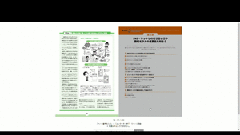
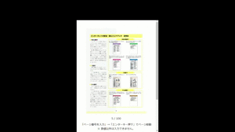
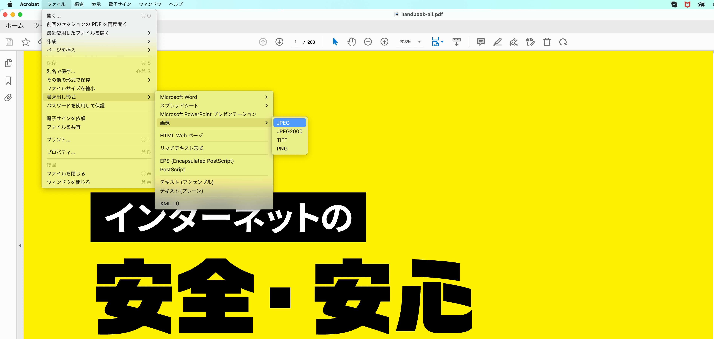
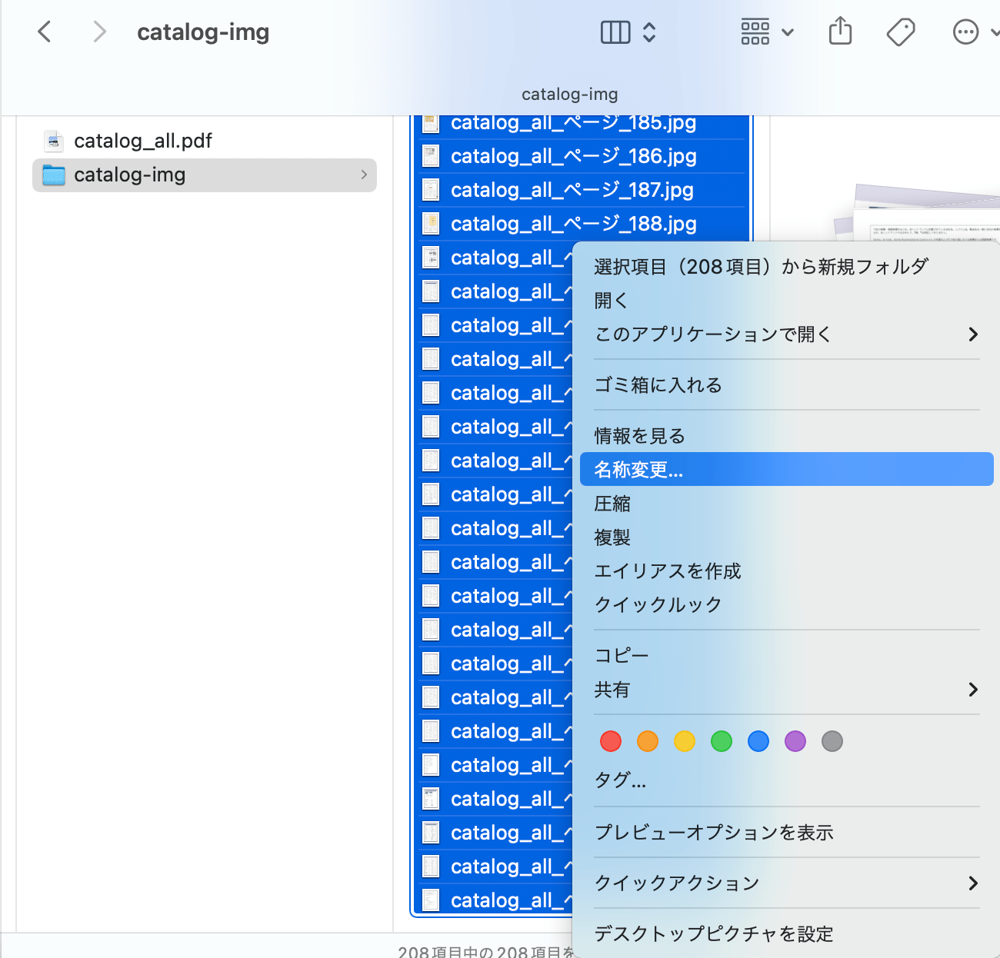
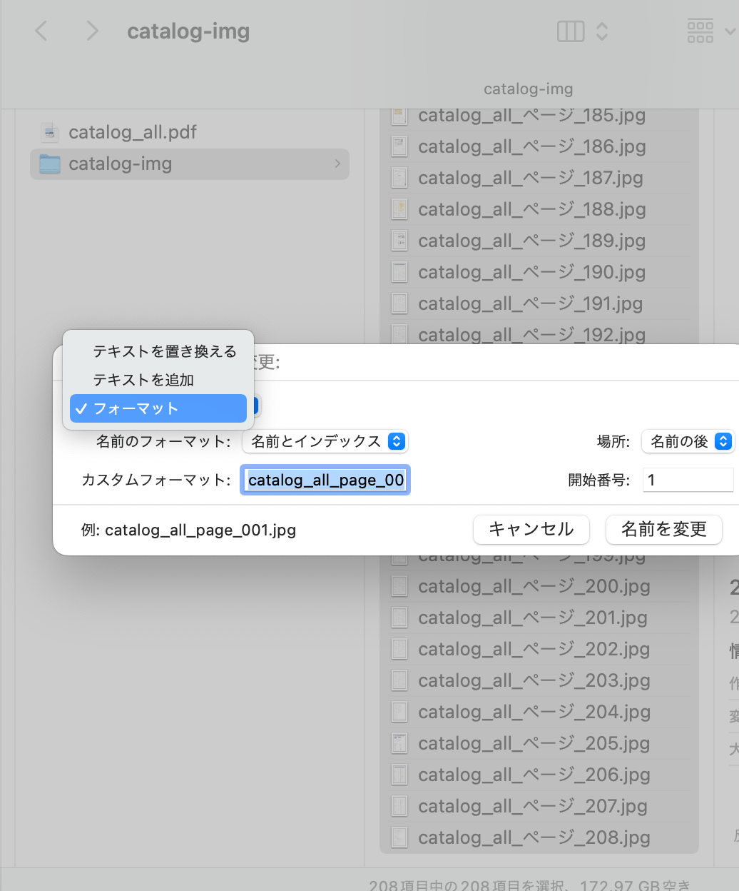
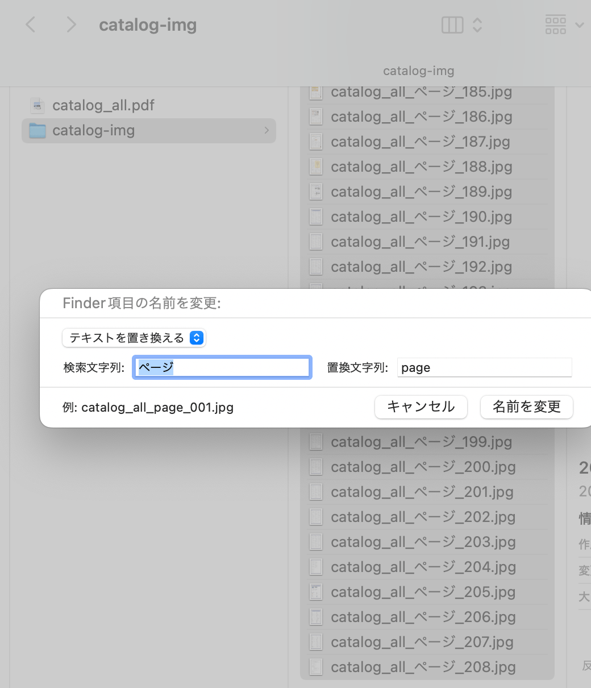

# BookReader
パンフレットや各種資料、冊子、雑誌などの見開きコンテンツを webブラウザ上で閲覧できるデジタルパンフレット機能です。<br />
資料ダウンロードやサービス・商品の効果的な販促・宣伝などを考えたときに「カタログや資料をテキストリンクだけで別タブ表示して閲覧してもらうよりも、イメージしやすいブックリーダー形式で表示したほうがファイルダウンロード率や訴求効果が高まるのでは？」と思って制作しました。<br />
ブラウザ幅が 700px 以下（スマホ閲覧時）では 1ページ表示仕様になります。

> [!NOTE] 
> サンプルドキュメントとして[内閣サイバーセキュリティセンター（NISC）](https://security-portal.nisc.go.jp/)が制作した[「インターネットの安全・安心ハンドブック - NISC」](https://security-portal.nisc.go.jp/guidance/handbook.html)を使用させていただいております。<br />
> BookReader（当リポジトリ）では、サンプルドキュメントのため一部の画像（100ページまで）しか扱っていませんが PDF は全ページ閲覧できるようになっています。

- （左）大きいディスプレイver、（右）スマートフォンver <br />



## 技術構成
- @tailwindcss/vite@4.1.12
- @types/react-dom@18.3.7
- @types/react@18.3.24
- @typescript-eslint/eslint-plugin@8.41.0
- @typescript-eslint/parser@8.41.0
- @vitejs/plugin-react@4.7.0
- eslint-plugin-react-hooks@4.6.2
- eslint-plugin-react-refresh@0.4.20
- eslint@8.57.1
- react-dom@18.3.1
- react@18.3.1
- tailwindcss@4.1.12
- typescript@5.9.2
- vite@6.3.5

## 用途
- パンフレットや資料といった各種ドキュメントの閲覧
- 資料ダウンロード前に商品やサービスの理解促進を行うことでその後の訴求効果UP？
- 家族や友人たちとの思い出の写真を残すデジタルプライベートアルバムとして？

## 各種設定
- ドキュメントのPDFファイルは`src/assets`ディレクトリに、ドキュメントの各ページ画像は`public/catalog-img`ディレクトリに置いてください。
- 対象ドキュメントが **縦書き（左開き）** の場合<br />
`src/PageComponents.tsx`の `const verticalWritingMode: boolean = false;` の値を `true`に変更してください。

## ビルド時（`npm run build`）の注意事項
1. 特定のディレクトリ or サブディレクトリに格納する場合
    - `vite.config.ts`の `base:` 箇所にパスを指定<br />
    例：example ディレクトリ内の book-reader ディレクトリ下に置く場合
    ```
    base: '/example/book-reader',
    ```

2. `src/utils/imgSrcPath.ts`で以下を調整
    - 画像パス（`imgSrcPath`）と、必要に応じて拡張子（`extendsType`）の設定を調整

3. `src/PageComponents.tsx`で最後のページ番号とコンテンツ名を指定
    - `const lastPageNum: number = 最後のページ番号（コンテンツの画像データの最大ナンバー）;`
    - `const documentTitle: string = 'コンテンツ名を指定';`
    - 【任意】ドキュメントが縦書き（左開き）の場合は`verticalWritingMode`を`true`にする

4. `src/hook/usePagination.ts`と`src/hook/useWaitLoadingAllImgs.ts`の以下を調整
    - 【任意】画像データファイルのナンバリング先頭に 0 or 00 などが前置する場合（例：画像データ名のナンバリング部分が「001 ~ 009」「010 ~ 099」「100 ~ 」という形）は`src/hook/useSetImgSrc.ts`カスタムフックを使用する（当該カスタムフックは現状コメントアウト）

5. 【任意】`src/libs/GetOtherFile.tsx`の以下を調整
    - カタログやマニュアルなど対象ファイルに応じて、`setFileContent`のpdfファイル名を変更（デフォルトは`document.pdf`）

## 補足事項
- 仕組み
    画像をクリックで`img`の`src`と`alt`を随時書き換えています。ページめくりの表現はCSS（`src/index.css`）の`animation`です。<br />
    ページ数入力で任意のページへ飛べます。入力欄は**数値以外受け付けず**、**1 〜 最終ページ番号の範囲内で機能**します。
    - 画像をクリックでの書き換え：`src/hook/usePagination.ts`の `PrevPage` と `NextPage`メソッド
    - ページ数入力後のページジャンプ：`src/hook/useSetInputPagerNumber.ts` の `SetInputPagerNumber`メソッド

- PDFから画像の書き出し + 一括リネームの方法（Mac）
<details>
<summary>PDFから画像の書き出し + 一括リネームの方法（Mac）</summary>

1. Adobe AcrobatでPDFから画像の書き出し方法


2. 書き出し画像を一括リネーム（Mac）：画像を全選択して「右クリック」 - 「名称変更」 


- 画像のファイルネームを任意の形へ書き換えたい場合：「フォーマット」を選択


- 画像のファイルネームの一部を変更したい場合：「テキストを置き換える」を選択

</details>
